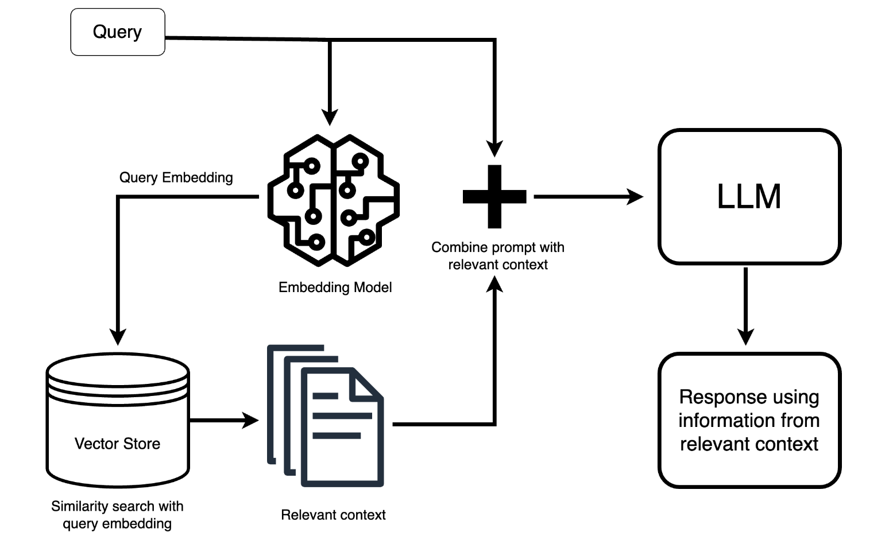

# Project Name

## Description

This project demonstrates a Retrieval Augmented Generation (RAG) system for a recruiting business case. The system allows users to query a knowledge base of documents to answer questions and gain insights.

## RAG Architecture Overview

The following diagram illustrates the high-level architecture of this RAG system:



The key stages are:

1. **Document Parsing:** Raw documents are processed and prepared for further analysis.
2. **Chunking:** Documents are divided into smaller, manageable chunks of text.
3. **Embedding Creation:**  Each chunk is transformed into a numerical vector representation (embedding) that captures its semantic meaning.
4. **Index Creation & Storage:** Embeddings are stored in a vector database (FAISS in this case) for efficient similarity search.
5. **Retrieval:**  Given a user query, relevant chunks are retrieved from the index based on similarity to the query's embedding.
6. **LLM Generation:** The retrieved chunks are provided as context to a Large Language Model (LLM), which generates a final answer.


## Getting Started

Follow these steps to set up and run the project:

**1. Environment Setup**

* Create a virtual environment:
  ```bash
  python -m venv venv
  .\venv\Scripts\activate  # On Windows
  source venv/bin/activate # On Linux/macOS

* Install dependencies:
    ```bash
    pip install -r requirements.txt
    ```

* A `.env` file should already have been created with the proper credentials.


**2. Data ingestion** 

* Start by populating the data folder with the documents you want to include in your knowledge base. This is the raw data that the RAG system will process.

* Ingest the files into the FAISS index using the following command:
    ```bash
    python -m src.ingestion.ingest_files
    ```
  This script handles the parsing, chunking, and embedding creation stages.  The resulting index will be saved to disk. Explore the `src/ingestion` directory for the code responsible for these steps.
  
  **Important**: This step is only implemented for PDF FIles. Please consider implementing the `Loader` classes for the other types of documents that you want to pass to the chatbot (e.g. DOCX).


**3. Running the Application**

* Now you can run the main application:
    ```bash
    python -m app
    ```
  This will start the Gradio interface, allowing you to interact with the RAG system.  The code for the main application logic can be found in `main.py`. Take a look at the `src` folder to see how services like LLMs, embeddings and the vector database are structured.

* **Prompting for Better Results:** When interacting with the chatbot, you can guide its responses by crafting effective prompts. Consider the following:
    * **Tone Control:**  Specify the desired tone (e.g., "Explain this in a formal tone").
    * **Scope Limitation:** Instruct the LLM to base its answers solely on the provided document context. This helps prevent hallucinations and ensures responses are grounded in your knowledge base.

## Project Structure

* `data/`: Contains the source documents for the knowledge base.
* `src/`:  Contains the source code for the project.
    * `ingestion/`: Code for ingesting and processing documents. Start by ingesting the documents.
    * `services/`: Core services like LLM interaction, embeddings, and vector database.
* `main.py`: The main application script. Check the `rag_chatbot` function, **implement it!**
* `requirements.txt`:  Lists the project dependencies.


## Further improvements
